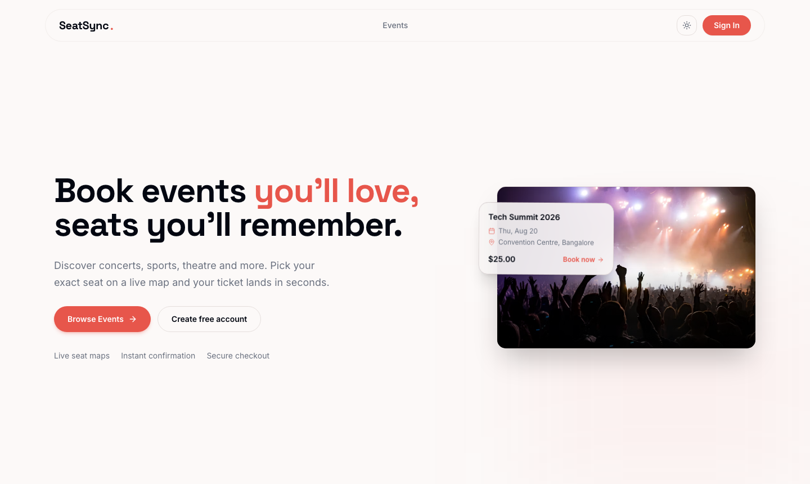
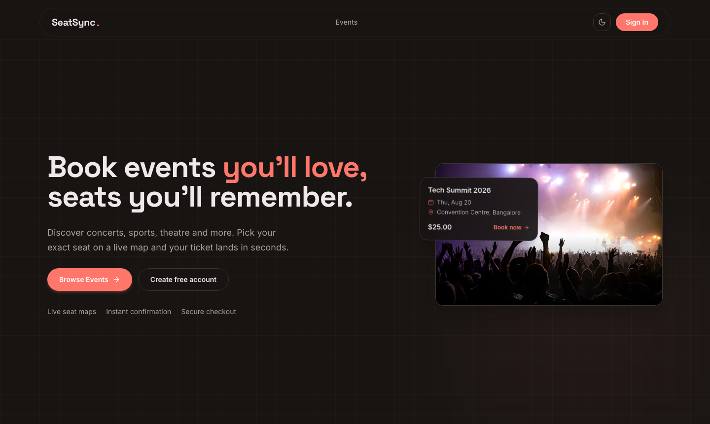
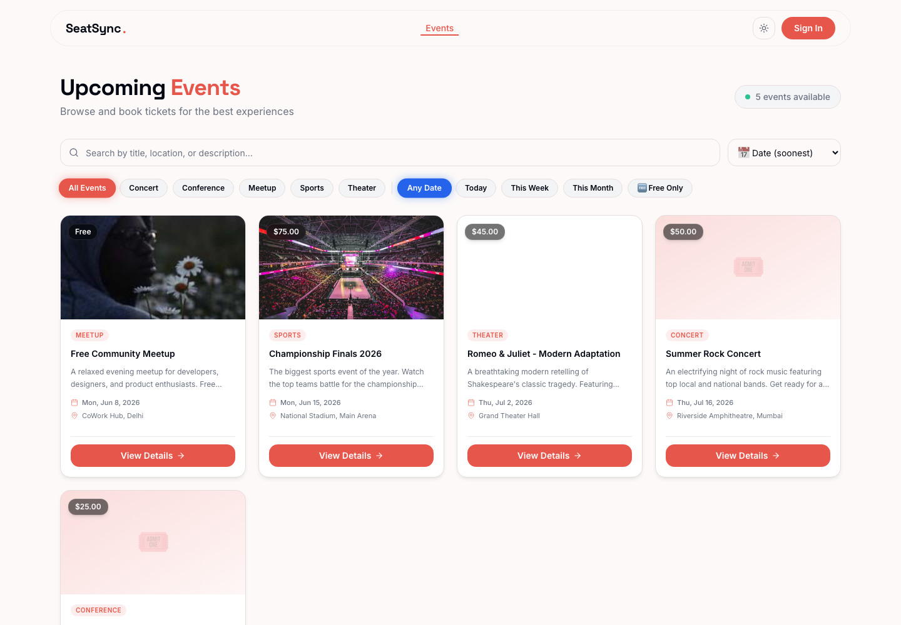
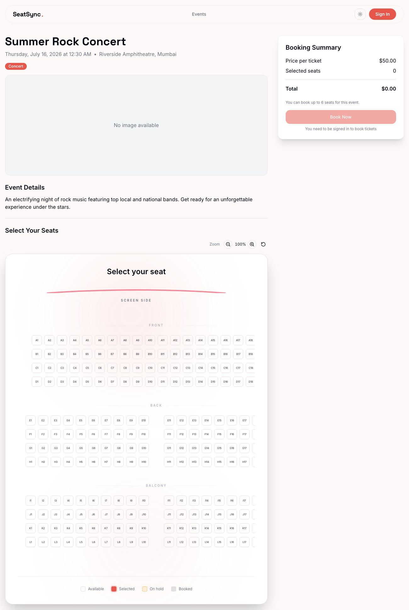
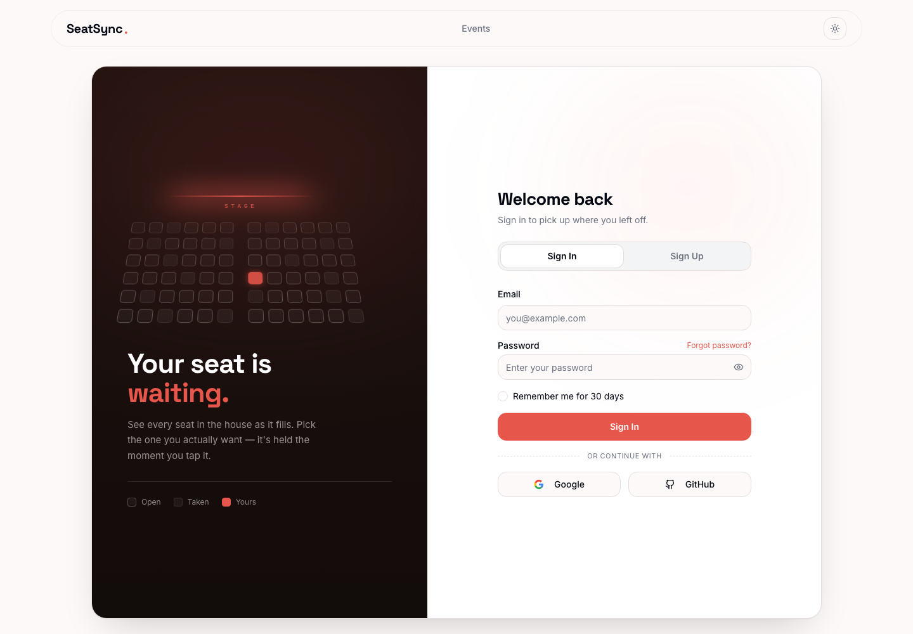

# 🎟️ SeatSync

A modern SaaS platform for event ticketing, seat reservations, and event management. SeatSync provides a seamless booking experience through an interactive seat selection system, secure authentication, real-time ticket generation, and a powerful admin dashboard.

## 🌐 Live Demo

https://seat-sync-five.vercel.app/

---

## 📸 Screenshots

> Captured from the live deployment at [seat-sync-five.vercel.app](https://seat-sync-five.vercel.app/).

### Home

|                    Light                     |                       Dark                        |
| :------------------------------------------: | :-----------------------------------------------: |
|  |  |

### Browse Events

Search, category facets, and date filters over every published event.



### Interactive Seat Selection

Live seat map with front / back / balcony tiers, zoom controls, and real-time
availability — available, selected, on hold, and booked.



### Authentication

Email and password, Google OAuth, or GitHub — with the product's own seat map as the brand panel.



---

## 📖 Overview

SeatSync is designed to simplify event management and ticket booking for organizers and attendees. The platform offers an intuitive interface for selecting seats, purchasing tickets, and managing events while ensuring scalability, security, and high performance.

Whether it's concerts, conferences, seminars, sports events, or theater shows, SeatSync delivers a smooth and reliable ticket booking experience.

---

## ✨ Features

### 🎫 User Features

* Interactive seat selection system
* Real-time seat availability
* Secure user authentication
* Google OAuth login
* Responsive booking experience
* Ticket confirmation and management
* Light and dark mode support

### 🛠️ Admin Features

* Event creation and management
* Ticket sales monitoring
* Booking analytics dashboard
* User management
* Ticket generation and validation
* Revenue tracking and insights

### 🚀 Platform Features

* Modern glassmorphism UI
* Responsive across all devices
* Fast loading and optimized performance
* Serverless architecture
* Scalable and secure infrastructure

---

## 🛠️ Tech Stack

### Frontend

* React.js
* Vite
* TypeScript
* Tailwind CSS
* Radix UI
* Framer Motion

### Backend

* Node.js
* Vercel Serverless Functions

### Database

* MongoDB
* Mongoose

### Authentication

* JWT (JSON Web Tokens)
* Google OAuth

### Deployment

* Vercel

---

## 🏗️ System Architecture

```bash
src/
├── components/
├── pages/
├── hooks/
├── context/
├── services/
├── utils/
├── assets/
└── App.tsx

api/
├── auth/
├── events/
├── tickets/
└── users/
```

---

## 🚀 Getting Started

### Clone the Repository

```bash
git clone https://github.com/DarkDevil-x/seat-sync.git
```

### Navigate to Project

```bash
cd seat-sync
```

### Install Dependencies

```bash
npm install
```

### Configure Environment Variables

Create a `.env` file in the root directory:

```env
MONGODB_URI=your_mongodb_uri
JWT_SECRET=your_jwt_secret
GOOGLE_CLIENT_ID=your_google_client_id
GOOGLE_CLIENT_SECRET=your_google_client_secret
APP_URL=http://localhost:8080
ALLOWED_ORIGIN=http://localhost:8080
GROQ_API_KEY=your_groq_key   # optional — admin AI description generation
```

`APP_URL` must match the dev server port (8080, set in `vite.config.ts`) and, in
production, your deployed origin — it is what builds the Google OAuth redirect URI.

### Configure Google OAuth

In [Google Cloud Console](https://console.cloud.google.com/apis/credentials) →
Credentials → OAuth 2.0 Client ID (Web application):

**Authorized JavaScript origins**

```
http://localhost:8080
https://your-domain.vercel.app
```

**Authorized redirect URIs**

```
http://localhost:8080/api/auth/google/callback
https://your-domain.vercel.app/api/auth/google/callback
```

The redirect URI must match `${APP_URL}/api/auth/google/callback` exactly — no
trailing slash — or Google returns `redirect_uri_mismatch`.

### Run Development Server

```bash
npm run dev
```

### Build for Production

```bash
npm run build
```

---

## 🔒 Security Features

* JWT-based authentication
* Secure Google OAuth integration
* Protected API routes
* Environment variable management
* Server-side validation

---

## 🎯 Key Highlights

* SaaS-based ticketing platform
* Interactive seat reservation system
* Real-time event booking workflow
* Scalable serverless architecture
* Secure authentication and authorization
* Modern UI/UX with responsive design

---

## 🔮 Future Enhancements

* Online payment gateway integration
* QR code-based ticket verification
* Email notifications
* Event recommendations using AI
* Multi-organizer support
* Advanced analytics and reporting
* Mobile application support

---

## 👨‍💻 Author

**Himanshu Singh**

* GitHub: https://github.com/DarkDevil-x
* Portfolio: Add Portfolio Link
* LinkedIn: Add LinkedIn Profile

---

## ⭐ Support

If you found this project helpful, consider giving it a star on GitHub.

⭐ Star this repository to support the project.

---

## 📄 License

This project is licensed under the MIT License.
